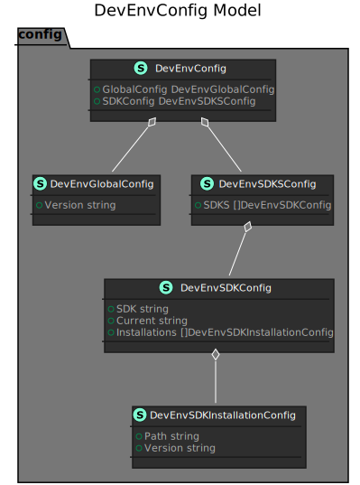

# Config


## Configuring the CLI
By default your local configuration file is persisted at `$HOME/.devenv/debug/devenv.yqml`


```yaml
global:
  version: v1

sdk:
  sdks:
    - sdk: java
      current: openjdk-11
      installations:
        - version: openjdk-15
          path: "/Library/Java/VirtualMachines/OpenJDK15/Contents/Home"
        - version: openjdk-11
          path: "/Library/Java/VirtualMachines/OpenJDK11/Contents/Home"
    - sdk: haskell
```


## DevEnvConfigModel Overview


