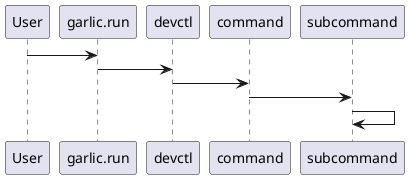

# Plugins

## What is a Plugin
Every cli command passed to `devctl` is a plugin.
A plugin may have as many plugins as you like.

## Flow

```puml
@startuml

"User"  -> garlic.run
garlic.run -> devctl


devctl -> command
command -> subcommand
subcommand -> subcommand

@enduml
```

