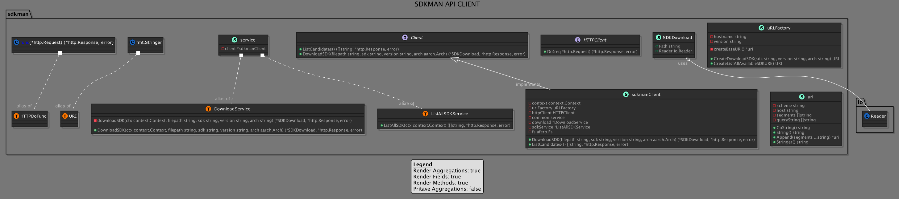
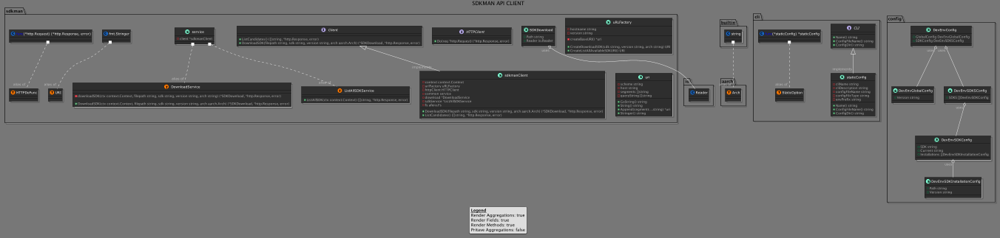

# Package internal/sdkman

Even though this package should not be used outside this project, i deed it worthwhile to document how it works.

## Motivation of this package
I want to download different versions of many SDK's and tooling.
Luckily there is [sdkman](https://sdkman.io) which already cared about the backend.

The idea is, to create a facade to where the SDK's get pulled from.

The sdkman api ist highly segregated, that's why I cluster my API calls by coherence, instead of api endpoints.  

 

## General Overview

## Usage in the rest of the code base

